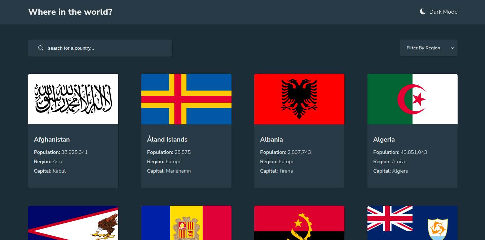

# Frontend Mentor - REST Countries API with color theme switcher solution

## [Live link](https://countries-fem.netlify.app/)

This is a solution to the [REST Countries API with color theme switcher challenge on Frontend Mentor](https://www.frontendmentor.io/challenges/rest-countries-api-with-color-theme-switcher-5cacc469fec04111f7b848ca). Frontend Mentor challenges help you improve your coding skills by building realistic projects. 

## Table of contents

- [Frontend Mentor - REST Countries API with color theme switcher solution](#frontend-mentor---rest-countries-api-with-color-theme-switcher-solution)
  - [Live link](#live-link)
  - [Table of contents](#table-of-contents)
  - [Overview](#overview)
    - [The challenge](#the-challenge)
    - [Screenshot](#screenshot)
    - [Links](#links)
  - [My process](#my-process)
    - [Built with](#built-with)
    - [What I learned](#what-i-learned)
    - [Continued development](#continued-development)
  - [Author](#author)
  - [Acknowledgments](#acknowledgments)

**Note: Delete this note and update the table of contents based on what sections you keep.**

## Overview

### The challenge

Users can do the following on this app:

- See all countries from the API on the homepage
- Search for a country using an search box
- Filter countries by region
- Click on a country to see more detailed information on a separate page
- Click through to the border countries on the detail page
- Toggle the color scheme between light and dark mode 

### Screenshot

### Links

- Solution URL: [Code available on Github](https://github.com/Johndiddles/fem-countries)
- Live Site URL: [Hosted on Netlify](https://countries-fem.netlify.app/)

## My process

### Built with

- Semantic HTML5 markup
- CSS custom properties
- Flexbox
- [React](https://reactjs.org/) - JS library
- Redux

### What I learned

I learnt how to integrate redux into my react app as I really needed it for my state management especially with returning the full name of the border countries since the country's api returns an alpha3code for the border countries instead of the border country's full name

### Continued development
At the moment, I really want to focus on my state management as it is an important part of using ReactJS and has really been a trouble. If anyone ever gets to read this, I'd appreaciate any material or tutorial to overcome this hurdle

## Author

- Github Profile - [@johndiddles](https://github.com/Johndiddles)
- Frontend Mentor - [@yourusername](https://www.frontendmentor.io/profile/Johndiddles)
- Twitter - [@itzjaybabs](https://www.twitter.com/itzjaybabs)

## Acknowledgments
I'll like to appreciate my hype-woman [@mo-renike](https://github.com/mo-renike) who has always been there to point out areas where I need to improve, encourage me and give a thumbs up for every aspect that was properly done
